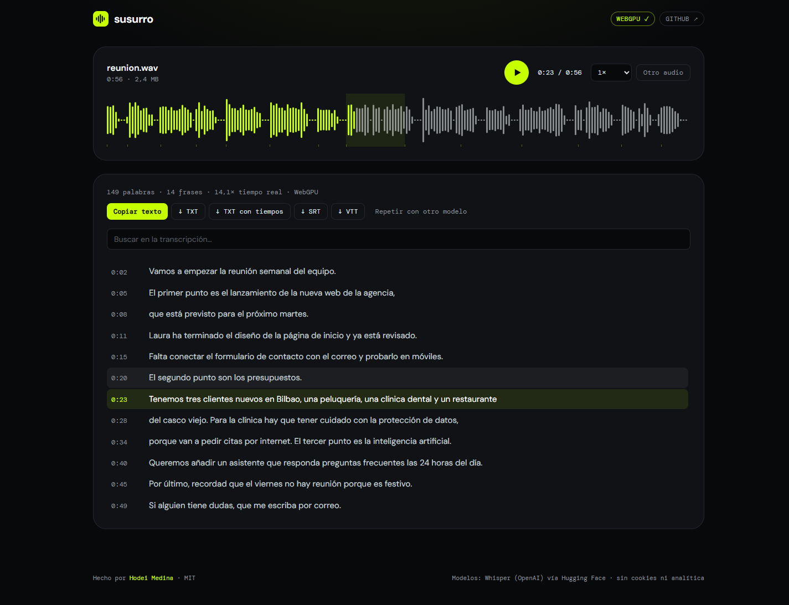
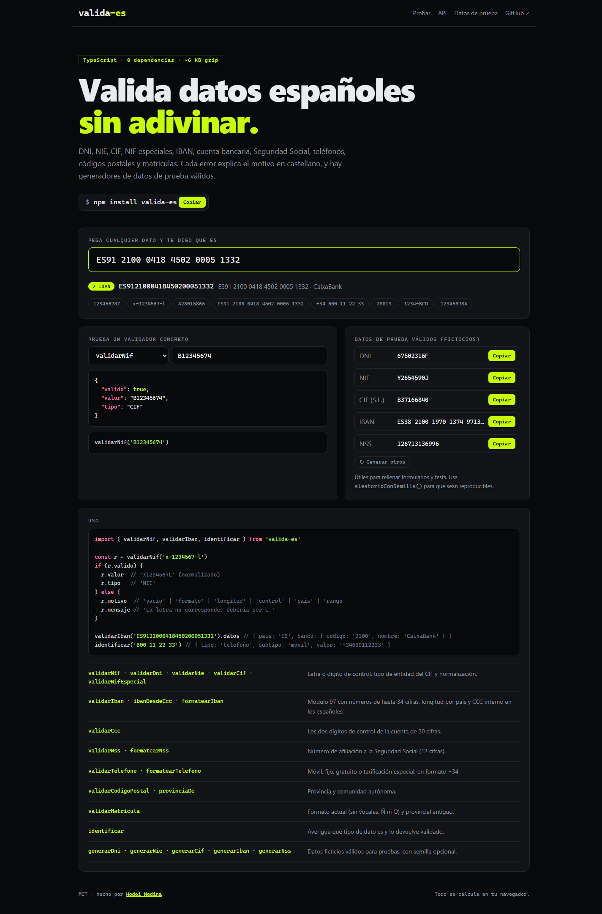
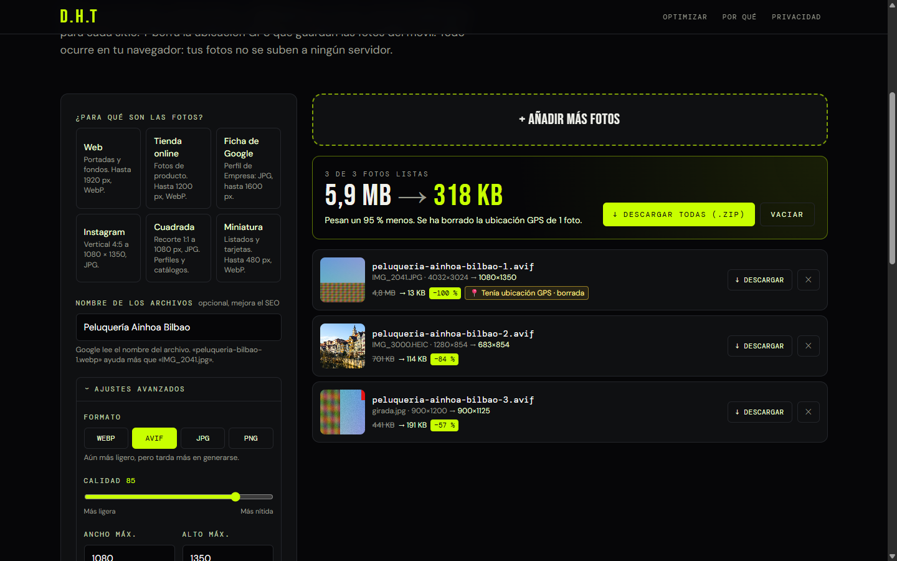
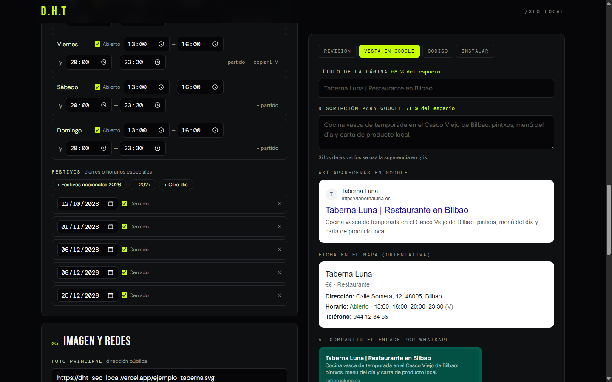

<!-- Banner -->
<p align="center">
  
</p>

<p align="center">
  <a href="https://h-com-bay.vercel.app">
    
  </a>
</p>

<p align="center">
  <a href="https://h-com-bay.vercel.app"></a>
  
  
</p>

---

## ⚡ Sobre mí

```ts
const hodei = {
  rol:        "Full-stack developer & fundador de DH Technology",
  ubicacion:  "Madrid, España",
  formacion:  "Máster en Inteligencia Artificial · Universidad Alfonso X el Sabio",
  stack:      ["Next.js", "TypeScript", "Node.js", "Prisma", "PostgreSQL"],
  ia:         ["Claude API", "LLMs en producción", "NLP", "Computer Vision"],
  ahoraMismo: "Llevando IA a webs y herramientas que usan negocios reales",
};
```

- 🏢 Dirijo **[DH Technology](https://h-com-bay.vercel.app)**, una agencia de webs, software, IA y SEO.
- 🤖 Me especializo en integrar **modelos de lenguaje** en productos: chats, generadores, auditorías y visión.
- 🎓 Estudio el **Máster en Inteligencia Artificial** en la Universidad Alfonso X el Sabio.

---

## 🛠️ Stack

<p align="center">
  <br/>
  <br/>
  
</p>

---

## 🚀 Proyectos destacados

<table>
  <tr>
    <td colspan="2" valign="top">
      <a href="https://susurro-ia.vercel.app"></a>
      <h3><a href="https://github.com/hodeione/susurro">🎙️ susurro</a> · <sub>IA en el navegador</sub></h3>
      <p><b>Transcribe audio a texto con Whisper sin subirlo a ningún servidor.</b> El modelo de OpenAI corre dentro del navegador con <b>WebGPU</b> o WebAssembly multihilo: 56 s de audio en ~4 s (<b>14× tiempo real</b>). Audios de WhatsApp, reuniones y vídeos; grabación por micrófono; onda interactiva sincronizada con el texto; búsqueda, edición y exportación a TXT, SRT y VTT; traducción al inglés.</p>
      <p>Troceado propio por silencios (energía RMS), inferencia en Web Worker con texto en streaming, precisión por dispositivo (int8 en CPU, fp16/q4 en GPU) y aislamiento COOP/COEP para hilos.</p>
      <p>
        
        
        
        
        
        
      </p>
      <a href="https://susurro-ia.vercel.app"><b>▶ Probar susurro</b></a>
    </td>
  </tr>
  <tr>
    <td colspan="2" valign="top">
      <a href="https://taberna-luna-dht.vercel.app"></a>
      <h3><a href="https://github.com/hodeione/reservas-n8n">🍽️ reservas-n8n</a> · <sub>carta 3D con realidad aumentada y reservas</sub></h3>
      <p><b>Web, reservas y carta con platos reales en 3D para restaurantes, con n8n de backend.</b> Apunta el móvil a un <b>plato vacío y te sirve el plato encima</b> (detector de platos propio, sin ARCore ni ARKit). El cliente <b>elige mesa en el plano</b>; si alguien cancela, la mesa pasa sola a la lista de espera; si va a llover, la terraza se recoge y se avisa a cada cliente. Panel sin código para el dueño y diez automatizaciones.</p>
      <p><a href="https://taberna-luna-dht.vercel.app"><b>▶ Demo en vivo</b></a> · React + TypeScript + three.js, 10 flujos de n8n generados por código, Docker (PostgreSQL + Caddy) y <b>79 pruebas de principio a fin</b>.</p>
      <p>
        
        
        
        
        
        
        
      </p>
    </td>
  </tr>
  <tr>
    <td colspan="2" valign="top">
      <h3><a href="https://github.com/hodeione/valida-es">✅ valida-es</a> · <sub>librería TypeScript</sub></h3>
      <p>Validación, formato y generación de <b>identificadores españoles</b>: DNI, NIE, CIF, NIF especiales, IBAN de 66 países, cuenta bancaria, Seguridad Social, teléfonos, códigos postales y matrículas. <b>Sin dependencias, ~6 KB gzip</b>, ESM y CommonJS con tipos, errores explicados en castellano y la función <code>identificar()</code>, que reconoce qué dato es.</p>
      <p>Módulo 97 exacto sin BigInt sobre números de 70 cifras, <b>pruebas de propiedades</b> (7.000 identificadores generados y mutados), TypeScript estricto, cobertura del 98 % e integración continua en Node 18 a 24.</p>
      <p>
        
        
        
        
        
      </p>
      <a href="https://hodeione.github.io/valida-es/"></a>
      <a href="https://hodeione.github.io/valida-es/"><b>▶ Probar la demo</b></a>
    </td>
  </tr>
  <tr>
    <td colspan="2" valign="top">
      <a href="https://dht-resenas.vercel.app"></a>
      <h3><a href="https://github.com/hodeione/dht-resenas">⭐ Kit de reseñas para Google</a> · <sub>nuevo</sub></h3>
      <p>Herramienta gratuita para que los negocios locales consigan más reseñas en Google y las respondan bien: genera <b>carteles con QR en 5 formatos a 300 ppp</b>, mensajes y firma de email, y un <b>respondedor con IA (API de Claude)</b> que propone tres respuestas y avisa de riesgos legales o de privacidad.</p>
      <p>
        
        
        
        
        
        
      </p>
      <a href="https://dht-resenas.vercel.app"><b>▶ Probar gratis</b></a>
    </td>
  </tr>
  <tr>
    <td colspan="2" valign="top">
      <a href="https://dht-fotos.vercel.app"></a>
      <h3><a href="https://github.com/hodeione/dht-fotos">🖼️ Optimizador de fotos para negocios</a> · <sub>nuevo</sub></h3>
      <p>Reduce el peso de las fotos hasta un 95 % con tamaños para web, Google e Instagram. Convierte <b>HEIC del iPhone</b>, genera WebP y AVIF, y <b>detecta y borra la ubicación GPS</b>. Todo con <b>WebAssembly y Web Workers</b> en el navegador: las fotos nunca se suben.</p>
      <p>
        
        
        
        
        
      </p>
      <a href="https://dht-fotos.vercel.app"><b>▶ Probar gratis</b></a>
    </td>
  </tr>
  <tr>
    <td colspan="2" valign="top">
      <a href="https://dht-seo-local.vercel.app"></a>
      <h3><a href="https://github.com/hodeione/dht-seo-local">📍 Generador de SEO local</a> · <sub>nuevo</sub></h3>
      <p>Genera datos estructurados <b>Schema.org LocalBusiness</b> (horario partido, festivos, coordenadas leídas de un enlace de Google Maps) con <b>0 errores en el validador oficial</b>, vista previa de Google medida en píxeles y de WhatsApp, y guía para WordPress, Wix y Shopify.</p>
      <p>
        
        
        
        
      </p>
      <a href="https://dht-seo-local.vercel.app"><b>▶ Probar gratis</b></a>
    </td>
  </tr>
  <tr>
    <td width="50%" valign="top">
      <a href="https://h-com-bay.vercel.app"></a>
      <h3><a href="https://github.com/hodeione/H.com">DH Technology</a></h3>
      <p>Web de agencia con estética brutalista y <b>4 integraciones de IA</b>: chatbot con streaming, generador de briefs, auditoría SEO/RGPD de cualquier URL y revisión de diseño por visión.</p>
      <p>
        
        
        
      </p>
      <a href="https://h-com-bay.vercel.app"><b>▶ Ver demo</b></a>
    </td>
    <td width="50%" valign="top">
      <a href="https://estudio-muia.vercel.app"></a>
      <h3><a href="https://github.com/hodeione/estudio-muia">Plataforma de Estudio · MUIA</a></h3>
      <p>Plataforma para estudiar el Máster en IA: NLP, Computer Vision, GANs, series temporales, recomendadores y calibración de modelos, organizada por unidades.</p>
      <p>
        
        
      </p>
      <a href="https://estudio-muia.vercel.app"><b>▶ Ver demo</b></a>
    </td>
  </tr>
  <tr>
    <td width="50%" valign="top">
      <h3><a href="https://github.com/hodeione/consola-negocios">📇 Consola de negocios</a></h3>
      <p>Scraper de Google Maps por lotes de zonas y sectores que además rastrea emails y teléfonos en la web de cada negocio. Incluye un <b>CRM</b> para gestionar llamadas, estados, prioridades y exportaciones.</p>
      <p>
        
        
        
        
        
      </p>
    </td>
    <td width="50%" valign="top">
      <h3><a href="https://github.com/hodeione/servicios-genesis">🌐 Servicios Génesis</a></h3>
      <p>Landing de servicios ligera, hecha sin frameworks.</p>
      <p>
        
        
      </p>
    </td>
  </tr>
</table>

---

## 📊 Estadísticas

<p align="center">
  
  
</p>

<p align="center">
  
</p>

---

## 🐍 Mis contribuciones

<picture>
  <source media="(prefers-color-scheme: dark)" srcset="https://raw.githubusercontent.com/hodeione/hodeione/output/snake-dark.svg" />
  <source media="(prefers-color-scheme: light)" srcset="https://raw.githubusercontent.com/hodeione/hodeione/output/snake-light.svg" />
  
</picture>

---

## 📫 Contacto

<p align="center">
  <a href="https://h-com-bay.vercel.app"></a>
  <a href="https://www.linkedin.com/in/hodei-medina-escribano-9053b130b"></a>
  <a href="https://github.com/hodeione"></a>
</p>

<p align="center">
  
</p>
