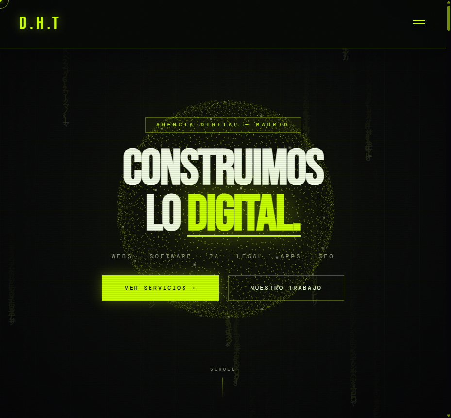
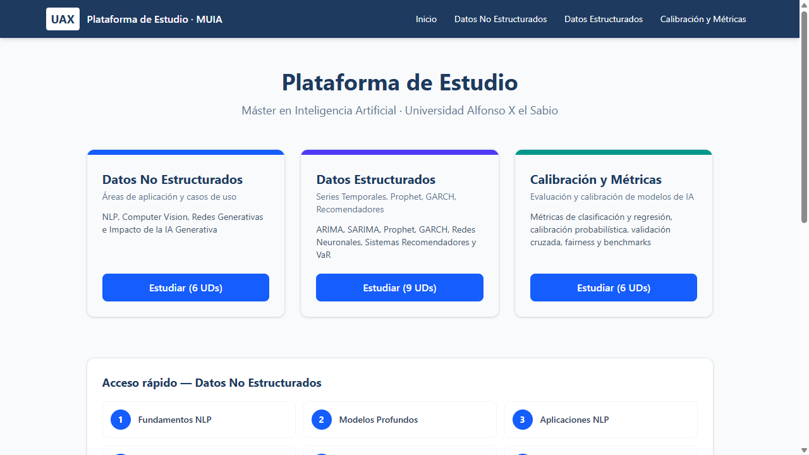

<!-- Banner -->
<p align="center">
  
</p>

<p align="center">
  <a href="https://h-com-bay.vercel.app">
    
  </a>
</p>

<p align="center">
  <a href="https://h-com-bay.vercel.app"></a>
  
  
</p>

---

## ⚡ Sobre mí

```ts
const hodei = {
  rol:        "Full-stack developer & fundador de DH Technology",
  ubicacion:  "Madrid, España",
  formacion:  "Máster en Inteligencia Artificial · Universidad Alfonso X el Sabio",
  stack:      ["Next.js", "TypeScript", "Node.js", "Prisma", "PostgreSQL"],
  ia:         ["Claude API", "LLMs en producción", "NLP", "Computer Vision"],
  ahoraMismo: "Llevando IA a webs y herramientas que usan negocios reales",
};
```

- 🏢 Dirijo **[DH Technology](https://h-com-bay.vercel.app)**, una agencia de webs, software, IA y SEO.
- 🤖 Me especializo en integrar **modelos de lenguaje** en productos: chats, generadores, auditorías y visión.
- 🎓 Estudio el **Máster en Inteligencia Artificial** en la Universidad Alfonso X el Sabio.

---

## 🛠️ Stack

<p align="center">
  <br/>
  <br/>
  
</p>

---

## 🚀 Proyectos destacados

<table>
  <tr>
    <td colspan="2" valign="top">
      <a href="https://dht-resenas.vercel.app"></a>
      <h3><a href="https://github.com/hodeione/dht-resenas">⭐ Kit de reseñas para Google</a> · <sub>nuevo</sub></h3>
      <p>Herramienta gratuita para que los negocios locales consigan más reseñas en Google: valida el enlace, genera <b>carteles con QR en 5 formatos a 300 ppp</b>, mensajes de WhatsApp/SMS/email y firma de email. 100 % en el navegador, sin servidor ni cookies.</p>
      <p>
        
        
        
        
        
      </p>
      <a href="https://dht-resenas.vercel.app"><b>▶ Probar gratis</b></a>
    </td>
  </tr>
  <tr>
    <td width="50%" valign="top">
      <a href="https://h-com-bay.vercel.app"></a>
      <h3><a href="https://github.com/hodeione/H.com">DH Technology</a></h3>
      <p>Web de agencia con estética brutalista y <b>4 integraciones de IA</b>: chatbot con streaming, generador de briefs, auditoría SEO/RGPD de cualquier URL y revisión de diseño por visión.</p>
      <p>
        
        
        
      </p>
      <a href="https://h-com-bay.vercel.app"><b>▶ Ver demo</b></a>
    </td>
    <td width="50%" valign="top">
      <a href="https://estudio-muia.vercel.app"></a>
      <h3><a href="https://github.com/hodeione/estudio-muia">Plataforma de Estudio · MUIA</a></h3>
      <p>Plataforma para estudiar el Máster en IA: NLP, Computer Vision, GANs, series temporales, recomendadores y calibración de modelos, organizada por unidades.</p>
      <p>
        
        
      </p>
      <a href="https://estudio-muia.vercel.app"><b>▶ Ver demo</b></a>
    </td>
  </tr>
  <tr>
    <td width="50%" valign="top">
      <h3><a href="https://github.com/hodeione/consola-negocios">📇 Consola de negocios</a></h3>
      <p>Scraper de Google Maps por lotes de zonas y sectores que además rastrea emails y teléfonos en la web de cada negocio. Incluye un <b>CRM</b> para gestionar llamadas, estados, prioridades y exportaciones.</p>
      <p>
        
        
        
        
        
      </p>
    </td>
    <td width="50%" valign="top">
      <h3><a href="https://github.com/hodeione/servicios-genesis">🌐 Servicios Génesis</a></h3>
      <p>Landing de servicios ligera, hecha sin frameworks.</p>
      <p>
        
        
      </p>
    </td>
  </tr>
</table>

---

## 📊 Estadísticas

<p align="center">
  
  
</p>

<p align="center">
  
</p>

---

## 🐍 Mis contribuciones

<picture>
  <source media="(prefers-color-scheme: dark)" srcset="https://raw.githubusercontent.com/hodeione/hodeione/output/snake-dark.svg" />
  <source media="(prefers-color-scheme: light)" srcset="https://raw.githubusercontent.com/hodeione/hodeione/output/snake-light.svg" />
  
</picture>

---

## 📫 Contacto

<p align="center">
  <a href="https://h-com-bay.vercel.app"></a>
  <a href="https://github.com/hodeione"></a>
</p>

<p align="center">
  
</p>
